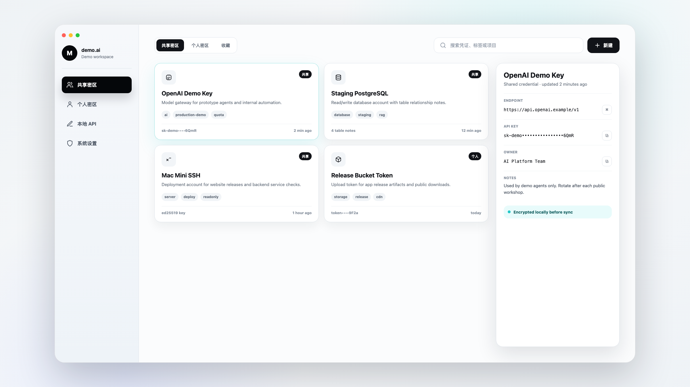
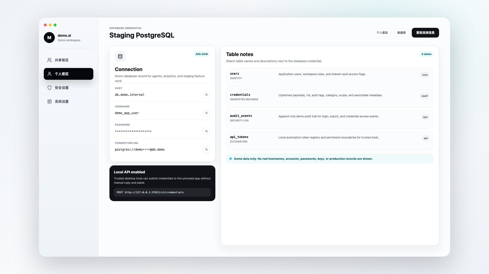

<p align="center">
  
</p>

<h1 align="center">MacMima</h1>

<p align="center">
  <a href="https://github.com/lanmu1818-ship-it/macmima/actions/workflows/ci.yml">
    
  </a>
  <a href="./LICENSE">
    
  </a>
</p>

<p align="center">
  为新晋 AI 开发者准备的账号、密码、API Key、服务器密钥、数据库凭证与团队配置安全储存方案。
</p>

<p align="center">
  <a href="./README_EN.md">English</a>
  ·
  <a href="./README.md">简体中文</a>
  ·
  <a href="https://macmima.flnxi.com">官网演示</a>
  ·
  <a href="./docs/APP_USAGE.md">APP 使用方法</a>
  ·
  <a href="./docs/BACKEND_DEPLOYMENT.md">后端部署教程</a>
  ·
  <a href="./docs/TECHNICAL_OVERVIEW.md">技术文档</a>
  ·
  <a href="./docs/RELEASES.md">发布构建</a>
</p>

## 项目定位

AI 开发者很快会积累一批高敏感资料：模型平台 API Key、云服务器 SSH
密钥、数据库账号密码、管理后台账号、Webhook Secret、团队共享配置等。
把这些资料散落在聊天记录、备忘录、表格或浏览器里，既难协作，也很难保证安全。

MacMima 是一个开源桌面密钥库，目标是把这些开发凭证收进一个可自托管、
可团队协作、默认加密的工作台里。

## 产品截图

以下截图仅使用虚构演示数据，不包含真实账号、密码、API Key、服务器地址或生产记录。





## 核心能力

- 个人密区：保存只有自己能解密的账号、密码、Key、服务器和数据库凭证。
- 共享密区：管理员可为用户开启共享区权限，让同一后端下的成员协作使用共享配置。
- 数据库表关系：数据库凭证可记录表名和说明，方便 AI 项目开发时快速理解数据结构。
- Markdown 文档：保存请求文档、API 示例、代码片段和协作说明。
- 开发讨论：同一工作台成员可讨论需求、粘贴图片、@ 在线成员，并按日期折叠历史。
- 本地 API：桌面端可开启 `127.0.0.1` 本地接口，让其他工具自动推送凭证。
- 工作台 Key：同一个后端可按工作台 Key 隔离团队数据。
- 管理后台：管理用户、邀请码、共享区访问权限。
- 自托管后端：Express + Prisma + MySQL，可部署在自己的服务器上。
- 跨平台打包：Electron 支持 macOS 与 Windows 构建。

## 安全模型：后端不保存明文凭证

MacMima 的基本原则是：后端负责同步、权限和多设备访问，真正敏感的凭证正文在桌面端加密后再上传。
后端数据库里不是明文密码、明文 API Key 或明文 SSH 私钥。

| 内容 | 是否明文进入后端数据库 |
| --- | --- |
| 网站密码、数据库密码、API Key、SSH 私钥、连接字符串、Markdown 文档、表说明等凭证正文 | 否，先在桌面端 AES-256-GCM 加密 |
| 用户主密码 | 否，不上传后端 |
| 登录校验值 | 不是明文密码，后端再用 Argon2id + `AUTH_PEPPER` 加固 |
| 凭证标题、分类、标签、创建时间等列表元数据 | 是，用于检索和展示，标题和标签里不要写 Secret |
| 密文、IV、认证标签 | 是，后端保存这些加密结果用于同步 |

个人密区使用用户主密码派生密钥。MacMima Crypto v2 可以叠加本机增强密钥，
该密钥只保存在本机，不上传后端。共享密区支持独立共享加密密钥，团队成员配置同一个值后，
新共享数据不再依赖工作台访问 Key 解密。旧共享数据仍兼容 v1 模式。
完整安全说明、威胁边界和后续加固路线见 [SECURITY.md](./SECURITY.md)。

## 快速开始

要求：

- Node.js 20+
- pnpm 9+
- MySQL 8+

启动桌面端开发环境：

```bash
pnpm install
pnpm dev
```

启动 Electron 开发环境：

```bash
pnpm electron:dev
```

启动后端：

```bash
cd server
pnpm install
cp .env.example .env
# 编辑 .env，配置 DATABASE_URL、JWT_SECRET、AUTH_PEPPER
npx prisma generate
npx prisma db push
pnpm build
pnpm start
```

后端生产部署请看 [后端部署教程](./docs/BACKEND_DEPLOYMENT.md)。

## 文档

- [产品介绍](./docs/INTRODUCTION.md)
- [APP 使用方法](./docs/APP_USAGE.md)
- [后端部署教程](./docs/BACKEND_DEPLOYMENT.md)
- [技术文档](./docs/TECHNICAL_OVERVIEW.md)
- [本地 API 接入](./docs/LOCAL_API.md)
- [发布与安装包构建](./docs/RELEASES.md)
- [文档总目录](./docs/README.md)
- [安全策略](./SECURITY.md)
- [贡献指南](./CONTRIBUTING.md)

## 目录结构

```text
.
├── electron/          # Electron main/preload 和本地 API
├── src/               # React 桌面应用
├── server/            # Express + Prisma 后端
│   ├── prisma/        # Prisma schema
│   └── src/           # API 源码
├── build/             # App 图标和打包资源
├── public/            # 静态资源
└── docs/              # 开源文档
```

官网源码与发布管理后台不包含在本次公开源码树中，是否公开将单独决定。

## 构建安装包

```bash
pnpm electron:build
pnpm electron:build:win
```

安装包会输出到 `release/`，该目录已被 Git 忽略。

Windows 正式发布物应使用 NSIS 安装器：`MacMima-版本-Setup-x64.exe`。安装器会创建桌面快捷方式、开始菜单快捷方式，并出现在 Windows 已安装应用列表中。zip 包只适合作为便携版或内部测试包。

Windows 正式安装器也可以通过 GitHub Actions 的 `Build Windows Installer`
工作流生成。详细步骤见 [发布与安装包构建](./docs/RELEASES.md)。

## 当前开源状态

当前质量门槛：

```bash
pnpm exec tsc --noEmit
cd server && pnpm build && pnpm audit --prod
```

ESLint 历史问题仍在清理中，建议在接受外部 PR 前继续收紧 lint 和测试门槛。

## License

MIT
