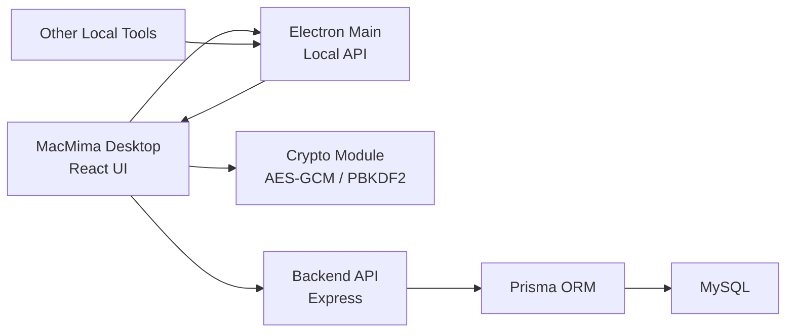

# 技术文档

本文面向准备阅读源码、二次开发或自托管 MacMima 的开发者。

## 技术栈

桌面端：

- Electron
- React
- TypeScript
- Vite
- Zustand
- Tailwind CSS

后端：

- Node.js
- Express
- Prisma
- MySQL
- JWT
- Argon2id

## 架构概览



关键边界：

- React UI 负责登录、密钥派生、加密、解密和交互。
- Electron Main 负责窗口、系统能力和本地 API。
- Express 后端负责账号、权限、同步、密文储存。
- MySQL 储存用户、工作台、邀请码、凭证密文和历史版本。

## 数据加密流程

### 个人密区

1. 用户输入主密码。
2. 前端使用用户 salt 和 PBKDF2 派生 AES-GCM 密钥。
3. 凭证内容在前端加密。
4. 后端只接收 `encryptedData`、`iv`、`authTag` 和元数据。
5. 读取时前端拉取密文并在本地解密。

### 共享密区

当前版本使用工作台 Key 派生共享密钥。这样同一工作台成员可以读取共享密区。

后续安全路线：

- 为每个用户生成公私钥对。
- 共享密区使用随机 vault key。
- vault key 分别用成员公钥包装。
- 移除“知道工作台 Key 即可派生共享密钥”的弱点。

## 登录认证流程

MacMima 为了兼容“主密码用于本地加密”的设计，前端不会把明文主密码发给后端。

1. 注册时，前端生成 salt。
2. 前端计算登录校验 hash。
3. 后端把登录校验值再用 Argon2id 和 `AUTH_PEPPER` 处理后入库。
4. 登录时后端校验 Argon2id verifier。
5. 校验通过后签发 JWT。

`AUTH_PEPPER` 必须只存在服务器环境变量中。如果数据库泄露，攻击者仍然不能直接拿库中 verifier 登录。

## 数据库模型

| 模型 | 表名 | 说明 |
| --- | --- | --- |
| `Workspace` | `workspaces` | 工作台记录，按工作台 Key hash 隔离团队 |
| `User` | `users` | 用户、管理员状态、共享区权限 |
| `InviteCode` | `invite_codes` | 邀请码和使用次数 |
| `Credential` | `credentials` | 凭证密文、分类、scope、标签 |
| `CredentialHistory` | `credential_history` | 凭证历史版本密文 |
| `SyncLog` | `sync_logs` | 同步记录 |

核心关系：

- 一个工作台下可以有多个用户、邀请码、凭证。
- 一个用户可以创建多个凭证。
- 凭证分为 `personal` 和 `shared` 两种 scope。
- `sharedAccess` 控制用户是否可访问共享密区。

## 后端 API 模块

| 模块 | 路径 | 说明 |
| --- | --- | --- |
| Auth | `/api/auth` | 注册、登录、当前用户 |
| Credentials | `/api/credentials` | 凭证增删改查 |
| Admin | `/api/admin` | 用户管理、邀请码、共享权限 |
| Sync | `/api/sync` | 同步相关接口 |
| Health | `/health` | 健康检查 |

所有业务 API 都需要 `X-MacMima-Workspace-Key` 参与工作台隔离。

## 本地 API 模块

Electron Main 进程可以启动一个只监听 `127.0.0.1` 的 HTTP 服务。

默认端口：

```text
37621
```

核心接口：

- `GET /health`
- `POST /v1/credentials`

本地 API 收到请求后不会直接写数据库，而是把规范化后的 payload 发给前端。
前端确认当前用户已解锁后，对数据加密，再通过后端 API 保存。

## 目录说明

```text
electron/
  main.ts       Electron 主进程、本地 API、窗口生命周期
  preload.ts    安全暴露给前端的 IPC API

src/
  pages/        主要页面
  components/   凭证卡片、表单、布局、本地 API bridge
  services/     后端 API client
  stores/       Zustand 状态
  utils/        加密、剪贴板、导出工具

server/
  src/index.ts          Express 入口
  src/routes/auth.ts    注册、登录、JWT
  src/routes/admin.ts   管理员能力
  src/routes/credentials.ts 凭证接口
  prisma/schema.prisma  数据模型
```

## 当前已知工程 TODO

- 补齐 Prisma migrations，替代生产环境 `db push`。
- 清理 ESLint 历史问题，并把 lint 纳入 CI 强制门槛。
- 增加端到端测试和后端 API 测试。
- 强化 Electron sandbox 和代码签名策略。
- 升级共享密区密钥分发方案。

