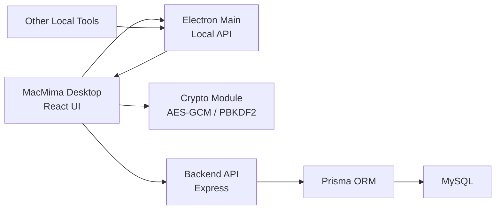

# Technical Overview

This document is for developers who want to read the source code, extend MacMima,
or self-host it.

## Stack

Desktop:

- Electron
- React
- TypeScript
- Vite
- Zustand
- Tailwind CSS

Backend:

- Node.js
- Express
- Prisma
- MySQL
- JWT
- Argon2id

## Architecture



Boundaries:

- React UI handles login, key derivation, encryption, decryption, and interaction.
- Electron Main handles windows, system capabilities, and Local API.
- Express handles accounts, permissions, sync, and ciphertext storage.
- MySQL stores users, workspaces, invite codes, credential ciphertext, metadata, and history.

## What Is In The Backend Database

The key concern is: if MacMima syncs to a backend, are all passwords plaintext in the database?

No. The `credentials` table stores encrypted output and metadata.

| Category | Examples | Plaintext visibility |
| --- | --- | --- |
| Credential body | Website passwords, database passwords, API keys, SSH private keys, connection strings, database table notes | Not stored plaintext. Encrypted before upload |
| Encrypted output | `encryptedData`, `iv`, `authTag` | Stored, but not directly usable |
| Listing metadata | `title`, `category`, `tags`, `scope`, timestamps | Stored plaintext for UI listing and search |
| Login material | User salt, Argon2id verifier | Does not contain plaintext master password and cannot decrypt Personal Vault data |

If only the MySQL database leaks, the attacker gets ciphertext and metadata, not directly
usable plaintext credentials. Metadata may still reveal service names or project structure,
so do not put real secrets in titles or tags.

## Data Encryption Flow

### Personal Vault

1. The user enters the master password.
2. The frontend derives an AES-GCM key with PBKDF2 and the user salt.
3. Credential body is encrypted locally.
4. The backend receives only `encryptedData`, `iv`, `authTag`, and metadata.
5. On read, the frontend downloads ciphertext and decrypts locally.

### Shared Vault

The current Shared Vault derives its key from the workspace key. This allows members of
the same workspace to read shared credentials.

Boundary: the workspace key is used for backend workspace isolation and current shared-key
derivation. If the backend runtime is fully compromised, an attacker may capture the workspace
key from request flow or misconfigured logs. Personal Vault encryption still depends on the
user's master password, not on the workspace key.

Roadmap:

- Generate per-user key pairs.
- Use a random shared vault key.
- Wrap the vault key for each member with that member's public key.
- Remove direct dependency on the workspace key for Shared Vault encryption.

## Authentication Flow

MacMima does not send the plaintext master password to the backend.

1. During registration, the frontend generates a salt.
2. The frontend computes a login verification hash. This is not the plaintext master password
   and cannot decrypt the Personal Vault.
3. The backend stores that value after Argon2id hashing with `AUTH_PEPPER`.
4. During login, the backend verifies the Argon2id verifier.
5. On success, the backend issues a JWT.

The login verification hash acts as an authentication credential. Production deployments
must use HTTPS and must not log request bodies.

## Threat Scenarios

| Scenario | Result |
| --- | --- |
| MySQL database only leaks | Credential bodies remain ciphertext; attacker can see metadata |
| `JWT_SECRET` leaks | Sessions may be forged, but Personal Vault ciphertext is not directly decrypted |
| `AUTH_PEPPER` and database leak | Login-verifier resistance is reduced; rotate pepper and force re-login |
| User forgets master password | Backend cannot recover Personal Vault plaintext |
| Malicious or modified client | Can read plaintext before encryption; this is a supply-chain risk for any client-side encryption tool |
| Backend runtime fully compromised | Auth, sync, and Shared Vault safety may be affected; rotate workspace key, JWT, pepper, and database password |

## Database Models

| Model | Table | Purpose |
| --- | --- | --- |
| `Workspace` | `workspaces` | Workspace records isolated by workspace key hash |
| `User` | `users` | User, admin status, Shared Vault permission |
| `InviteCode` | `invite_codes` | Invite code and usage count |
| `Credential` | `credentials` | Credential ciphertext, category, scope, tags |
| `CredentialHistory` | `credential_history` | Credential ciphertext history |
| `SyncLog` | `sync_logs` | Sync records |

## Backend API Modules

| Module | Path | Purpose |
| --- | --- | --- |
| Auth | `/api/auth` | Register, login, current user |
| Credentials | `/api/credentials` | Credential CRUD |
| Admin | `/api/admin` | User management, invite codes, Shared Vault permission |
| Sync | `/api/sync` | Sync-related APIs |
| Health | `/health` | Health check |

Business APIs require `X-MacMima-Workspace-Key` for workspace isolation.

## Local API Module

Electron Main can start an HTTP server that listens only on `127.0.0.1`.

Default port:

```text
37621
```

Endpoints:

- `GET /health`
- `POST /v1/credentials`

The Local API does not write plaintext directly to the database. It sends normalized payload
to the frontend. The unlocked frontend encrypts it and then saves through the backend API.

## Source Layout

```text
electron/
  main.ts       Electron main process, Local API, window lifecycle
  preload.ts    IPC APIs exposed to the frontend

src/
  pages/        Main pages
  components/   Credential cards, forms, layout, Local API bridge
  services/     Backend API client
  stores/       Zustand stores
  utils/        Crypto, clipboard, export helpers

server/
  src/index.ts              Express entry
  src/routes/auth.ts        Register, login, JWT
  src/routes/admin.ts       Admin features
  src/routes/credentials.ts Credential API
  prisma/schema.prisma      Data model
```

## Current Engineering TODO

- Add Prisma migrations instead of production `db push`.
- Clean up ESLint issues and make lint a required CI gate.
- Add end-to-end tests and backend API tests.
- Strengthen Electron sandboxing and code-signing strategy.
- Upgrade Shared Vault key distribution.
